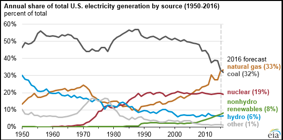
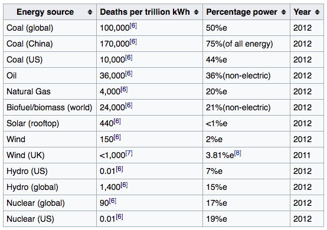
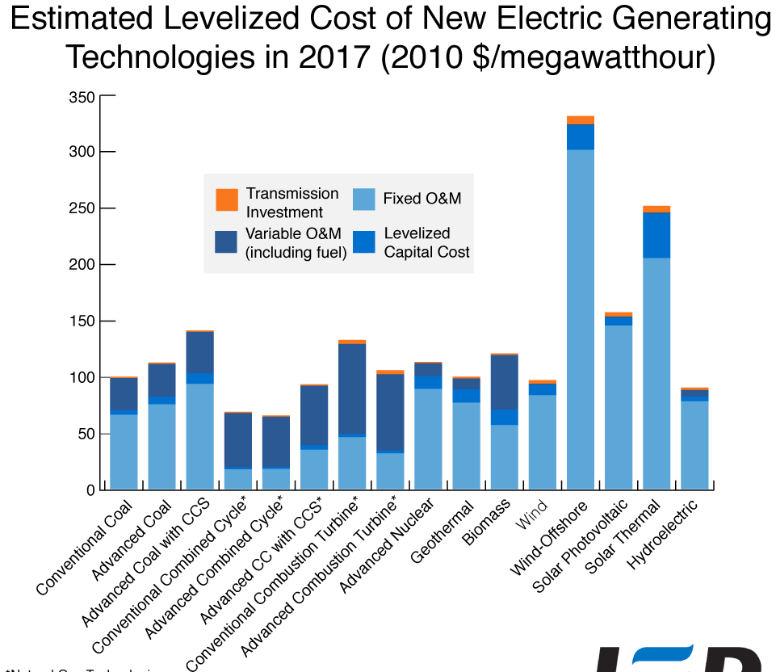
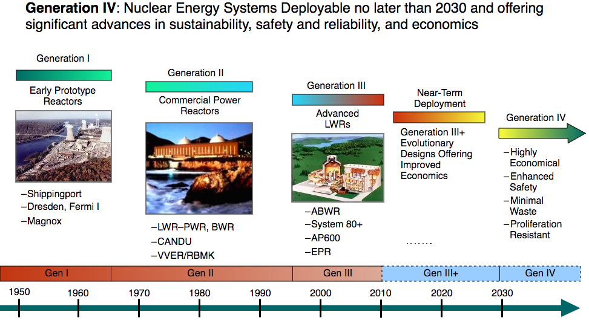
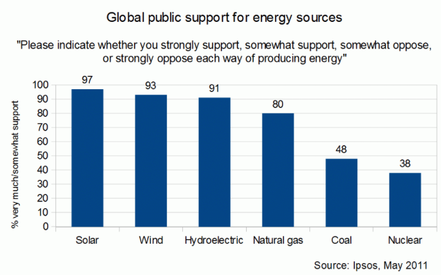

These are notes from a recent presentation that give an overview of nuclear energy and the considerations surrounding it.

{: .img-fluid}

### Nuclear Construction

~450 reactors world wide

~70 under construction, mostly in China, where coal power air pollution is an urgent issue

~5 under construction in the US, the first permits issued in 34 years

### Energy-related Fatalities

{: .img-fluid}

**Coal:** Historically, coal mining has been a very dangerous activity and the
list of historical[ coal](https://en.wikipedia.org/wiki/Coal)[ mining
disasters](https://en.wikipedia.org/wiki/Mining_disasters) is a long one. In
the US alone, more than 100,000 coal miners were killed in accidents over the
past century,[^1] with more than 3,200 dying in 1907 alone.[^2] In the decades
following this peak, an annual death toll of 1,500 miner fatalities occurred
every year in the US until approximately the 1970s.[^3] Death rates per year
between 1990 and 2012 have continued to decline, with in the US below 100 coal
mining fatalities per annum occurring each year during this period.[^4]

**Hydro:** Dominated by one disaster in which Typhoon Nina in 1975 washed out the[ Shimantan Dam](https://en.wikipedia.org/wiki/Shimantan_Dam) (China) and 171,000 people perished.

**Oil:** The rupture of the[ NNPC petroleum pipeline](https://en.wikipedia.org/wiki/1998_Jesse_pipeline_explosion) in 1998 and the resulting explosion cause 1,082 deaths.

**Nuclear:** The 1986[ steam explosion](https://en.wikipedia.org/wiki/Steam_explosion) at the[ Chernobyl nuclear reactor](https://en.wikipedia.org/wiki/Chernobyl_disaster) in the Ukraine caused approximately 4000 deaths in total, to eventually result in the decades ahead due to the[ radio-isotope](https://en.wikipedia.org/wiki/Radio-isotope) pollution released.

**Carbon Emissions Fatalities:** By far the greatest energy fatalities that
result from energy generation by humanity, is the creation of[ air pollution](https://en.wikipedia.org/wiki/Air_pollution). The most lethal of
which, [ particulate matter](https://en.wikipedia.org/wiki/Particulate_matter),
 is primarily generated from the burning of [ fossil fuels](https://en.wikipedia.org/wiki/Fossil_fuel) and [biomass](https://en.wikipedia.org/wiki/Biomass) and is estimated to cause 2.1
million deaths annually.[^5] [^6]

Nuclear emissions (full lifecycle): 16g CO2 eq/kWh, similar to wind & solar

Coal and natural gas: 820 and 490 g CO2 eq/kWh

### Nuclear Storage

There are some 65,000 tons of nuclear waste now in temporary storage throughout
the
U.S.[^7] Since 1987, [Yucca Mountain](https://en.wikipedia.org/wiki/Yucca_Mountain), in
Nevada, had been the proposed site for the [Yucca Mountain nuclear waste
repository](https://en.wikipedia.org/wiki/Yucca_Mountain_nuclear_waste_repository),
but the project was shelved in 2009 following years of controversy and legal
wrangling.[^8] [^9] An alternative plan has not been
proffered.[^10]

Without a long-term solution to store nuclear waste, a[ nuclear renaissance](https://en.wikipedia.org/wiki/Nuclear_renaissance) in the U.S. remains unlikely. Nine states have "explicit moratoria on new nuclear power until a storage solution emerges".[^11] [^12]

There is an "international consensus on the advisability of storing nuclear waste in deep underground repositories",[^13] but no country in the world has yet opened such a site.

### Cost Competitiveness

{: .img-fluid}

### New Reactor Designs

{: .img-fluid}

* Passive safety systems
* Reduced cost of construction & operation (but not yet clear exactly how much)

### Controversy

Observers attribute the nuclear controversy to the impossibility of generating
a shared perception between social actors over the use of this technology[^14]
as well as systemic mismatches between expectations and experience.

{: .img-fluid}

Arguments in favor:

* [Renewable energy](https://en.wikipedia.org/wiki/Renewable_energy) and[ energy efficiency](https://en.wikipedia.org/wiki/Efficient_energy_use) may not solve the energy and climate crises
* Nuclear fuel is virtually unlimited and has extremely high[ specific energy](https://en.wikipedia.org/wiki/Specific_energy)
* New technology may be able to safely dispose of[ nuclear waste](https://en.wikipedia.org/wiki/Nuclear_waste)
* Nuclear power is claimed to be the safest energy option
* Advanced nuclear power may strengthen global security
* Nuclear power's true costs are claimed to be lower than either fossil fuels or renewables
* Nuclear power may lead the "[clean energy](https://en.wikipedia.org/wiki/Clean_energy)" revolution

Arguments against (from Lowe):[^15]

* It may not be a fast enough response to[ climate change](https://en.wikipedia.org/wiki/Climate_change)
* It is claimed to be too expensive
* The need for[ baseload electricity](https://en.wikipedia.org/wiki/Baseload_electricity) may be exaggerated
* The problem of waste may still remain unresolved
* It may increase the risk of[ nuclear war](https://en.wikipedia.org/wiki/Nuclear_war)
* There are claimed to be major safety concerns
* There are claimed to be better alternatives

### Decommissioning

After a cooling-off period that may last as long as a century, reactors must be dismantled and cut into small pieces to be packed in containers for final disposal. The total energy required for decommissioning can be as much as 50% more than the energy needed for the original construction. In the U.S. there are 13 reactors that have permanently shut down and are in some phase of decommissioning, and none of them have completed the process.

### Federal Subsidy

There is a federal insurance subsidy for incidents beyond cost of $10bn in the US.

### Radioactivity from coal

Coal plants release more radioactivity into the environment than nuclear plants, through the release of thorium and uranium in[ coal ash](https://en.wikipedia.org/wiki/Coal_ash).[^16]

### Long-term effects of working at or living near nuclear power plants

Studies conducted by non-profit, neutral agencies have found no compelling
evidence of correlation between nuclear power and risk of
cancer.[^17]

### References

[^1]: <https://en.wikipedia.org/wiki/Energy_accidents#cite_note-npr.org-1>
[^2]: <https://en.wikipedia.org/wiki/Energy_accidents#cite_note-Coal_Mining_Steeped_in_History-2>
[^3]: <https://en.wikipedia.org/wiki/Energy_accidents#cite_note-11>
[^4]: <https://en.wikipedia.org/wiki/Energy_accidents#cite_note-12> 
[^5]: <https://en.wikipedia.org/wiki/Energy_accidents#cite_note-spaceref.com-4>
[^6]: <https://en.wikipedia.org/wiki/Energy_accidents#cite_note-iopscience.iop.org-5>
[^7]: <https://en.wikipedia.org/wiki/Nuclear_power_in_the_United_States#cite_note-tim2011-104>
[^8]: <https://en.wikipedia.org/wiki/Nuclear_power_in_the_United_States#cite_note-tim2011-104>
[^9]: <https://en.wikipedia.org/wiki/Nuclear_power_in_the_United_States#cite_note-105>
[^10]: <https://en.wikipedia.org/wiki/Nuclear_power_in_the_United_States#cite_note-106>
[^11]: <https://en.wikipedia.org/wiki/Nuclear_power_in_the_United_States#cite_note-108>
[^12]: <https://en.wikipedia.org/wiki/Nuclear_power_in_the_United_States#cite_note-bluerib-109>
[^13]: <https://en.wikipedia.org/wiki/Nuclear_power_in_the_United_States#cite_note-go-110>
[^14]: <https://en.wikipedia.org/wiki/Nuclear_power_debate#cite_note-DM2014-7>
[^15]: <https://en.wikipedia.org/wiki/Nuclear_power_debate#cite_note-bl-25>
[^16]: <https://en.wikipedia.org/wiki/Nuclear_power_debate#cite_note-151>
[^17]: <https://en.wikipedia.org/wiki/Nuclear_power_debate#cite_note-168>
