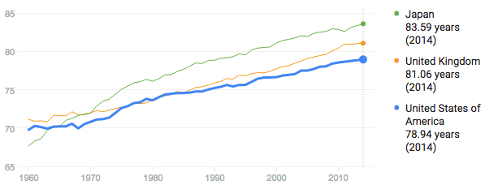

These are notes from a recent presentation. They serve as a very terse review of anti-aging research as it stands today.

### Context

Lifespan in animals is highly variable. Hydra are biologically immortal, glass sponges live to 10k+ years, and Ming, an ocean quahog, lived to 507.[^1]

The longest human lifespan was 122 years for Jeanne Calment, a French woman.

Avg. lifespan in the US is 76 for men, 81 for women.

From 1990-2014, it increased consistently at a rate of 1 year of life per 7 years.[^2]

Biological aging is observable as an increase in mortality rate with age, and is the greatest risk factor for nearly every cause of mortality, including heart disease, cancer, diabetes, stroke, and cognitive decline.[^3]

**Healthspan:** years of healthy life. Aging treatments should focus on extending healthspan.

### Why do organisms age?

Most researchers agree that antagonistic pleiotropy is the leading explanation.[^4]

**The idea:** genes that increase the odds of successful reproduction early in life may have deleterious effects later in life. Because the gene’s harmful effects do not appear until after reproduction is over, they cannot be eliminated through natural selection.[^5]

### Why is there hope for anti-aging interventions? 					

By the late 1990s, researchers had found that single mutations could triple the lives of of *C. elegans* (a small worm), and similar mutations were found for fruit flies, mice, and other organisms.[^4] This gives hope that the same could be found for humans.

However, so far, there have been repeated failures in attempts to extend human life. Resveratrol, a widely publicised molecule from red wine, still has no evidence supporting its ability to extend lifespan.[^6] Despite extensive study, multivitamins and antioxidant supplements also show no evidence of benefit and multiple vectors of harm (beta-carotene, vitamin A & E increase mortality, antioxidants may interfere with cancer treatments, increase risk of colon & lung cancer).[^7] 

### Mechanisms of aging

Generally, aged tissues lose their capacity for homeostasis.

**Oxidative stress**: reactive oxygen species (ROS), primarily from respiration in mitochondria, cause an accumulation over time of damage to cellular components and DNA.[^5]

**Telomere shortening**: Human cells can divide about 50x before the telomere becomes too short and senescence (cellular inactivity, no reproduction and altered chemistry) is triggered.[^5]

**Cross linking**: inappropriate bonds between DNA, proteins, and other structures develop during aging, leading to dysfunction (skin wrinkles, AD plaques)[^5]

**Accumulation of mutations**: due to ROS and other causes, mutations accumulate in tissues, leading to dysfunction and cancers5

**Neuroendocrine decline**: as a human ages, hormonal activity changes and becomes more erratic, leading to high blood pressure, poor sleep, and cellular dysfunction[^5]

**Accumulation of senescent cells:** Senescent cells do not regenerate, do not fulfil their role effectively, and emit hormones that cause dysfunction globally (beyond their own tissue and organ)[^8]

**Depletion of stem cells:** Stem cells are essential for tissue regeneration (brain, muscle, organ, etc…), but become depleted with age[^9]

**Epigenetics:** It has been found that the expression levels of almost 100 genes changes with age. These differences may be responses to the stresses of aging or causal of aging itself.[^10]

**Immune system dysfunction/inflammation:** Immune system dysfunction and inflammation increase with age. In addition to preventing infection, the immune system is important for tissue remodeling, removal of dysfunctional cells, wound healing, and regeneration. Immune dysfunction could be a key causal factor in other aging mechanisms.[^4] [^11]

### Promising interventions

Many promising interventions target the above processes.

**Caloric Restriction (CR):** Shown to be effective in worms, fruit flies, and mice, with mixed but promising results in primates. Researchers are investigating pathways affected by CR for a pharmacological alternative.[^4] [^12]

**Young Blood:** Mouse experiments have shown rejuvenation of old mice when they are given transfusions of young blood. Researchers are looking for molecular differences in young blood to find a pharmacological alternative.[^4]

**Metformin:** First-line treatment for diabetes in use since the 50s with very few side effects. Patients with diabetes taking metformin had longer lives than a healthy control without diabetes. In clinical trials now as anti-aging intervention, the first trial concludes at the end of 2017.[^4] [^13]

**Rapamycin Analogs:** Used as immune system suppressant during organ transplants. Shown to rejuvenate elderly immune systems by Novartis in 2014. Elderly patients, who respond less to flu vaccines, had an improved response after 2 weeks of taking a rapamycin analog. The rapamycin pathway (mTOR) tweaks immune systems and suppresses deleterious senescent cell secretions. It also extends mouse lifespans.[^4] [^12]

**Senolytics:** Drugs that eliminate senescent cells and increase lifespan in rodent models.[^8] [^12]

### What can I do now to extend my healthspan?

**Exercise:** Shown to reduce obesity, risk of heart disease, stroke, diabetes, neurodegeneration, cancer, and all-causes mortality.[^14] [^15] [^16]

**Nutrition:** Increasing consumption of whole grains, vegetables, fruits, nuts, and fish is associated with reduced all-cause mortality, while increased red meat and processed meat is associated with increased mortality.[^17] However, these results seem less well established than exercise.

**Sunscreen:** Daily use causes 24% reduction in skin aging in RCT,[^18] as well as reducing risk of some skin cancers.[^19]

### References

[^1]: [https://en.wikipedia.org/wiki/List_of_longest-living_organisms](https://en.wikipedia.org/wiki/List_of_longest-living_organisms)

[^2]: [https://www.google.com/search?q=us+lifespan](https://www.google.com/search?q=us+lifespan)

[^3]: Kaeberlein, Matt, Peter S. Rabinovitch, and George M. Martin. "Healthy aging: The ultimate preventative medicine." Science 350.6265 (2015): 1191-1193.

[^4]: [http://cen.gext.acs.org/articles/95/i10/hit-snooze-button-aging.html](http://cen.gext.acs.org/articles/95/i10/hit-snooze-button-aging.html)

[^5]: De, Abhijit, and Chandan Ghosh. "Basics of aging theories and disease related aging-an overview." PharmaTutor 5.2 (2017): 16-23.

[^6]: [https://en.wikipedia.org/wiki/Resveratrol](https://en.wikipedia.org/wiki/Resveratrol)

[^7]: [https://en.wikipedia.org/wiki/Antioxidant](https://en.wikipedia.org/wiki/Antioxidant)

[^8]: Childs, Bennett G., et al. "Cellular senescence in aging and age-related disease: from mechanisms to therapy." Nature medicine 21.12 (2015): 1424-1435.

[^9]: Oh, Juhyun, Yang David Lee, and Amy J. Wagers. "Stem cell aging: mechanisms, regulators and therapeutic opportunities." Nature medicine 20.8 (2014): 870-880.

[^10]: De Magalhães, João Pedro, João Curado, and George M. Church. "Meta-analysis of age-related gene expression profiles identifies common signatures of aging." Bioinformatics 25.7 (2009): 875-881.

[^11]: Brown, Bryan N., Brian M. Sicari, and Stephen F. Badylak. "Rethinking regenerative medicine: a macrophage-centered approach." Frontiers in immunology 5 (2014).

[^12]: Kirkland, James L. "Translating Advances from the Basic Biology of Aging into Clinical Application." Experimental gerontology 48.1 (2013): 1–5. PMC. Web. 8 July 2017.

[^13]: [https://clinicaltrials.gov/ct2/show/NCT02432287](https://clinicaltrials.gov/ct2/show/NCT02432287)

[^14]: Ahlskog, J. Eric et al. "Physical Exercise as a Preventive or Disease-Modifying Treatment of Dementia and Brain Aging." Mayo Clinic Proceedings 86.9 (2011): 876–884. PMC. Web. 8 July 2017.

[^15]: [https://en.wikipedia.org/wiki/Physical_exercise](https://en.wikipedia.org/wiki/Physical_exercise)

[^16]: [http://www.cochrane.org/CD002968/ENDOC_exercise-for-type-2-diabetes-mellitus](http://www.cochrane.org/CD002968/ENDOC_exercise-for-type-2-diabetes-mellitus)

[^17]: Schwingshackl, Lukas, et al. "Food groups and risk of all-cause mortality: a systematic review and meta-analysis of prospective studies." The American Journal of Clinical Nutrition 105.6 (2017): 1462-1473.

[^18]: Hughes MCB, Williams GM, Baker P, Green AC. Sunscreen and Prevention of Skin Aging: A Randomized Trial. Ann Intern Med. 2013;158:781-790. doi: 10.7326/0003-4819-158-11-201306040-00002

[^19]: https://en.wikipedia.org/wiki/Sunscreen
