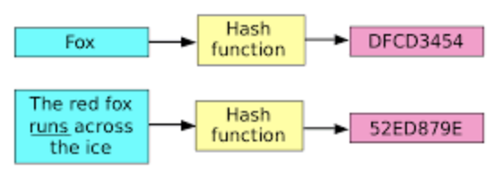
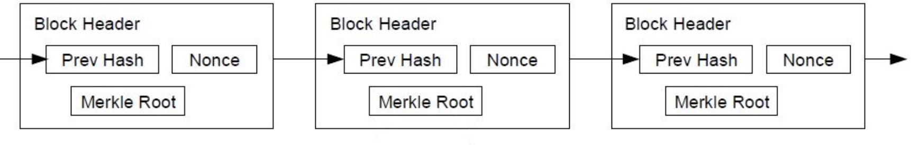

Cryptocurrencies center around one data structure: a distributed **ledger**. However, they implement it in many different ways. Here we’ll focus on Bitcoin.

**Ledger:** An ordered list of **transactions**. A ledger allows nodes on a cryptocurrency network to understand which accounts hold which coins, and detect + prevent efforts at cheating, like double-spending a coin or spending coins you never had. Usually implemented as a **blockchain**.

**Transaction:** Usually a transfer of coins from one account to another. Transactions must be **digitally signed** using **public key cryptography**, so any observer can verify that the sender approved the transaction.

**Public key cryptography:** Each entity generates a public key and a private key. They are effectively extremely large numbers, and they have an amazing property: data encrypted with the public key can only be decrypted by the private key, and vice versa. An entity shares the public key to everyone, and keeps the private key secret. 

**Digital signature** (with public key cryptography): Alice wants to prove to Bob that she has signed a transaction. She shares her public key, and then adds a signature to the transaction using her private key. The signature consists of a **hash** of the transaction contents encrypted with her private key. Bob can then compute the same hash himself, use Alice’s public key to decrypt the signature. If he compares the hash he computed to the decrypted signature, he has proof that someone with Alice’s private key signed the transaction.

**Hash**: 

{: .img-fluid}

A hash function takes an input of any length, and returns a constant-length result. SHA256 (what Bitcoin mostly uses) always produces a number 256 bits long. It is deterministic (the same input always produces the same result), one-way (given the input, the output is easy to generate, but the output tells you nothing about the input), chaotic (a one character change to the input produces an entirely different result), and collision-resistant (it is astronomically improbable that two different inputs produce the same output).

A hash is a good way to summarize a large document. If the hash of two documents is the same, you can be sure they are the same document. It’s like a fingerprint.

**Blockchain**:

{: .img-fluid}

In Bitcoin, the blockchain is a series of blocks. Each includes the hash of the last block, a **Merkle Tree** (we won’t get into this) of transactions in the block, and a **nonce**. Creating a new block requires finding a nonce (an arbitrary number) which causes the hash of the block to be extremely small. If the current **mining** difficulty requires 9 leading zeros on the hash, a miner must, on average, try 1 billion different nonces to produce a valid block. Since each block requires a lot of work to create, and each block contains the hash of the block before it, the entire blockchain provably took a tremendous amount of work to generate. This is called **proof of work.**

**Proof of work:** The Bitcoin protocol allows for trustless consensus. All of the nodes use the same rule for consensus: the longest blockchain (the one requiring the most work) is the correct one. If I try to create a new blockchain where I received 100 extra BTC last year, I’d have to take the chain as of one year ago, edit a block there, and then recreate all the blocks since then to have a longer chain. Unless I have access to much of the world’s computing power (like the NSA), my blockchain will always be shorter, and therefore it will be rejected.

**Mining:** The process of creating new blocks by trying trillions of different nonces to find a **golden nonce**, one that leads to a block hash lower than the difficulty. As miners add more computers (and switch to ASICs specially made to mine Bitcoin), the network adjusts the difficulty up so that a new block is mined roughly every 10 minutes.

**A note about trust:** While there is no trust necessary to achieve consensus on which blockchain is correct, trust in the software that most other nodes are running is still necessary. If I convinced the big miners and most users of bitcoin to run a new version of the software that has 1,000 extra BTC all owned by me, that would become the new truth. People running the old software would disagree, but they would be in the minority. This is more or less what a fork is, leading to two different versions of the currency.

### Other currencies:

* Ethereum: allows smart contracts, code that is run on the network and cannot be tampered with or stopped once launched. This allows Initial Coin Offerings (ICOs) that sell new coins according to predefined volume and pricing rules.

* Ripple / Stellar: networks that depend on federated or centralized trust in network nodes to avoid proof of work or proof of stake consensus. They have no mining and are far more efficient.

* Zcash: Bitcoin transactions are public. Zcash adds shielded transactions that are private.

* FileCoin (ICO): Not yet implemented, but ICOed for >$200M. Distributed storage system.

