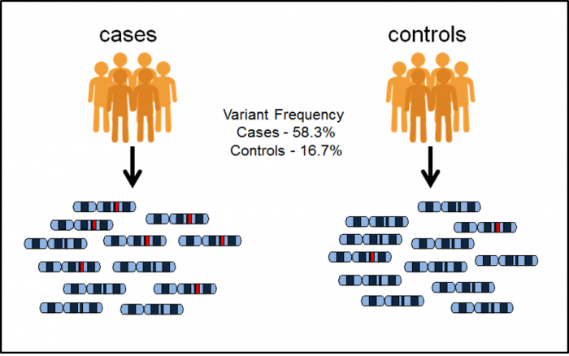
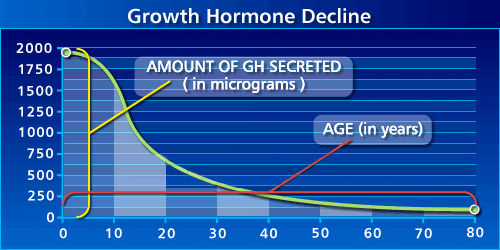

No study has yet convincingly demonstrated a drug that can increase [healthspan](https://publichealth.wustl.edu/heatlhspan-is-more-important-than-lifespan-so-why-dont-more-people-know-about-it/) in humans. There have been randomized controlled trials (RCTs) in model organisms such as mice and *c. elegans* finding a wide variety of dietary, genetic, pharmacological, and exercise interventions that extend lifespan [^1], but these results have not been replicated in humans. There have been observational studies showing promising results for calorie restriction and exercise in humans, but more human RCTs are needed to be confident in the results.

The central reason for this is that a human RCT using healthspan as its primary endpoint is very difficult to run. Such an RCT faces the following challenges:

1. **Low death rate.** Only patients who reach the end of their lifespan (or healthspan) during the study contribute to the statistical power of the study. In a uniform random sample of humans, under 2% will die each year.

2. **Slow action.** If we make the reasonable assumption that the benefit of a healthspan intervention (such as calorie restriction) is roughly proportional to its duration, a study of an intervention that lasts a year will observe an effect size two orders of magnitude smaller than a study that lasts a lifetime.

Other clinical trials typically do not face these challenges. Consider a clinical trial for a blood pressure (BP) medication, for example, where the endpoint is the percentage of patients who have high BP measurements. It will typically be conducted on a population that already has sustained high BP. The ideal BP medication would theoretically be able to reduce the percentage of patients with high BP readings from 100% to 0%. In contrast, a year-long ideal lifespan intervention on a random population would only be able to reduce the death rate from about 2% to 0%.

The natural approach for remedying this issue to only include people who are likely to die soon in a healthspan trial, but this introduces new issues. Lifespan interventions are intended to help the population at large, not only very sick individuals. An intervention that is found to be effective in very sick individuals, while exciting, may have no effect or even the opposite effect in the general population. Also, it may not truly be a life extending intervention. It might merely treat a specific condition such as diabetes that is common in the sick population. The only way to demonstrate generalized healthspan extension properties of an intervention is to test it in a cohort that is close in composition to the general population.

The BP trial is also looking to find interventions that are fast-acting. An effective BP medication will take effect in weeks or months, not in years or decades. While we’d love a similar speed of action in a longevity intervention, it’s probably not realistic. The differences between a young and an aged body are present in all tissues, organs, and cells, at many different scales, and involve deep changes that have taken a lifetime to accrue. While it’s possible that fast-acting interventions exist, it’d be surprising if they were anything but a rare exception. Most interventions will probably resemble calorie restriction or exercise, which deliver incremental benefits with each additional year they are practiced. Such interventions will have a much smaller effect on healthspan during the course of a 1-2 year trial than in a lifelong trial, making the effect very hard to detect unless an enormous study is conducted.

Combining the two factors above (**low death rate** has a linear effect and **slow action** has a quadratic effect), we can derive that if we cut the length of a healthspan RCT in half but want to keep its statistical power constant, the study size must increase by roughly a factor of 8. In other words, the cost of a healthspan study skyrockets as its duration decreases. Given that drug patents last 20 years in the US, pharmaceutical companies face strong headwinds attempting to demonstrate the effectiveness of a healthspan drug to the FDA in that window and still have time to offset drug development costs by selling the drug.

## A Modest Alternative: the GWAS Approach

While not suitable for an FDA trial, an alternative is to use [natural experiments](https://en.wikipedia.org/wiki/Natural_experiment) to build strong evidence in favor of healthspan interventions. Genetic variation is a natural experiment, as it randomly assigns different genes to different individuals for their lifetimes. It allows researchers to identify causal relationships between genes (and therefore regulatory pathways that the genes affect), and healthspan or lifespan. Genome wide association studies (GWASs) that use this method aren’t perfect (perhaps a particular gene is more common in a particular region, and healthspan is longer in that region for environmental reasons), but they’re an effective and popular methodology that has produced thousands of discoveries [^2].

{: .img-fluid}
Figure 1. GWAS methodology as shown by EBML-EBI. It identifies genetic variants that are significantly more frequent in the case group than in the control group.

That said, GWASs have largely been disappointing for explaining multi-genic conditions [^3] like aging. While GWASs have identified many genetic variants that likely play a causal role in multi-genic conditions, they typically only explain a small fraction of the heritable component of the conditions. GWAS studies that focus on longevity are no exception. 

Genetics have been estimated to explain between 15% and 25% of variation in longevity[^4], and that percentage more than doubles when looking at an individual’s chances of reaching age 100 once they have turned 60[^5]. Given this, we can be confident that genetics plays an important role in determining longevity, but GWAS techniques only expose the tip of the iceberg. Let’s look at what we’ve learned about longevity from GWASs.

## GWAS Longevity Results

Only two genes: APOE and FOXO3, have a compelling longevity story, with both showing an association with longevity in multiple independent studies. The odds of reaching 90 years of age go up by a factor of 1.2 when an individual has the beneficial variant of APOE, and 1.17 for the beneficial variant of FOXO3[^4]. It’s disappointing that there aren’t more genes with stronger associations, but it’s still valuable. Let’s dive more into the two genes and the pathways they are involved in.

### FOXO3

The FOXO3 gene is involved in the production of [Insulin-like Growth Factor 1](https://en.wikipedia.org/wiki/Insulin-like_growth_factor_1) (IGF-1). The IGF-1 signaling pathway (IIS) is the most evolutionarily conserved pathway of aging, shown to modulate lifespan in model organisms across a great evolutionary distance: from *c. elegans* to mice[^5]. Dietary restriction is a well-known environmental signal shown to extend lifespan in eukaryote species, from yeast to primates. The "longevity response" to dietary restriction is regulated by several nutrient-sensing pathways: the kinase TOR, AMP kinase, sirtuins, and the IIS[^5]. FOXO proteins are the most important transcriptional effectors of the IIS, which brings us to a basic understanding of the link between FOXO3 and aging. The beneficial variant of FOXO3 may create some of the same biological conditions as dietary restriction, by way of the IIS and IGF-1.

The connection between IGF-1 and longevity is complicated. IGF-1 and [Growth Hormone](https://en.wikipedia.org/wiki/Growth_hormone) (GH) are very similar steroid hormones. IGF-1, when given to older adults, combats muscle loss as well as cognitive decline by promoting new nerve growth[^6]. IGF-1 can have beneficial effects later in life likely because the concentration of IGF-1 and GH declines as the body ages.

{: .img-fluid}
Figure 2: amount of GH secreted in humans declines with age. From [Josh Mitteldorf]( https://joshmitteldorf.scienceblog.com/2015/09/04/hgh-and-igf-promise-and-danger/).

Due to the regenerative effects of IGF-1 when given to older adults, and its apparent decline as humans age, there has been marked interest in IGF-1 for enhancing longevity. However, we also find the opposite narrative. Studies in *c. elegans*, *drosophila*, and mutagenic mouse models found that decreased levels of GH/IGF-1 delayed the onset of aging[^7]. In the words of Sonntag et al.:

> ...two disparate concepts evolved and remain present in the literature (a) that the presence of normal levels of GH and IGF-1 accelerate aging and lack of these hormones or disruption of the signaling pathways governed by these hormones exert antiaging effects and (b) that the age-related decline in GH and IGF-1 contribute to the deterioration of physiological function and replacement of these hormones delay or reverse the aging phenotype.

Invertebrate studies consistently find that interrupting the GH/IGF-1 signaling pathway increases lifespan, and the same has been found repeatedly in dwarf, Ames mice, and GH receptor knockout mice. However, other rodent studies show inconsistent results. In many cases, no effect was found, or the increase in lifespan was only present in female mice. The effects of GH/IGF-1 deficiency appear to be species and strain specific, making it difficult to conclude what its effects may be in humans.

Direct evidence from a large meta-study in humans indicates that the relationship between GH/IGF-1 levels and longevity is U-shaped[^8]. Humans with low levels tend to have cardiovascular disease, while high levels are associated with cancer mortality. Importantly, the effects of increased GH/IGF-1 appear to vary by tissue type in humans. It appears to be beneficial in neuronal and vascular tissues, but also causes insulin sensitivity and kidney disease, which decrease lifespan. This brings us to the conclusion that the FOXO3 variant likely does not extend lifespan by simply raising or lowering IGF-1 levels, but by having a more complex effect on the IIS pathway.

### APOE

APOE is a gene that produces a protein (Apolipoprotein E) that is also known as APOE. It is known to play a major role in lipid homeostasis. It helps to determine the levels (and ratio) of LDL and HDL cholesterol in the body[^9]. LDL and HDL cholesterol, in turn, show a strong relationship with cardiovascular disease. The ε3 variant of APOE has also been implicated in Alzheimer’s disease.

Much of what we understand about APOE’s role in aging comes from APOE knockout mice. These mice develop high cholesterol followed by atherosclerotic lesions early in their lives, and subsequently have shorter than average lifespans and healthspans. In their study, Bonomini et al.[^10] performed a detailed examination of APOE knockout mice from ages 6 to 20 weeks, documenting changes in morphology and biomarkers compared with normal control mice.

It’s important to note that this study examines the effects of APOE knockout, while GWAS studies in humans identified a beneficial variant of APOE. The presence or absence of the beneficial variant is distinct from complete APOE knockout, and there’s no reason they will have the same effects. However, both affect the same gene and can be expected to create their downstream effects largely via the same pathways.

In addition to previous findings that APOE knockout mice develop hypercholesterolemia and atherosclerotic plaques as they age, the authors also find fibrosis, pro-inflammatory cytokine increase, lipofuscin accumulation and a decrease of antioxidant enzymes in the kidney, liver, and heart. These conditions develop significantly faster in APOE knockout mice when compared with controls, and effect sizes are large.

Given this research, we can conclude that APOE appears to play a role in the proper function of the immune system as well as mediating factors that cause heart disease. The consequences of dysfunction in either area accumulate with age and lead to early mortality.

## A Prediction

While GWAS approaches have only found longevity associations for FOXO3 and APOE, we can be reasonably confident that the pathways these genes are involved in have a direct causal connection to longevity. This is because GWASs are examining the results of natural experiments in humans, which provide higher quality evidence than observational studies on humans or RCTs on model organisms. Based on the results of human GWAS studies, we can predict that longevity drug development that focuses on the IGF-1 signaling pathway or the function of the APOE protein will likely be fruitful.

## References

[^1]: Fontana, Luigi, and Linda Partridge. "Promoting health and longevity through diet: from model organisms to humans." Cell161.1 (2015): 106-118.

[^2]: https://www.ebi.ac.uk/training/online/course/gwas-catalog-exploring-snp-trait-associations/what-tool-name

[^3]: Visscher, Peter M., et al. "Five years of GWAS discovery." The American Journal of Human Genetics 90.1 (2012): 7-24.

[^4]: Broer, Linda, et al. "GWAS of longevity in CHARGE consortium confirms APOE and FOXO3 candidacy." Journals of Gerontology Series A: Biomedical Sciences and Medical Sciences 70.1 (2014): 110-118.

[^5]: Martins, Rute, Gordon J. Lithgow, and Wolfgang Link. "Long live FOXO: unraveling the role of FOXO proteins in aging and longevity." Aging cell 15.2 (2016): 196-207.

[^6]: https://joshmitteldorf.scienceblog.com/2015/09/04/hgh-and-igf-promise-and-danger/

[^7]: Sonntag, William E., et al. "Diverse roles of growth hormone and insulin-like growth factor-1 in mammalian aging: progress and controversies." Journals of Gerontology Series A: Biomedical Sciences and Medical Sciences 67.6 (2012): 587-598.

[^8]: Burgers, Anne Marij G., et al. "Meta-analysis and dose-response metaregression: circulating insulin-like growth factor I (IGF-I) and mortality." The Journal of Clinical Endocrinology & Metabolism 96.9 (2011): 2912-2920.

[^9]: Smith, Jonathan D. "Apolipoproteins and aging: emerging mechanisms." Ageing research reviews 1.3 (2002): 345-365.

[^10]: Bonomini, Francesca, et al. "Apolipoprotein E and its role in aging and survival." Experimental gerontology 45.2 (2010): 149-157.
